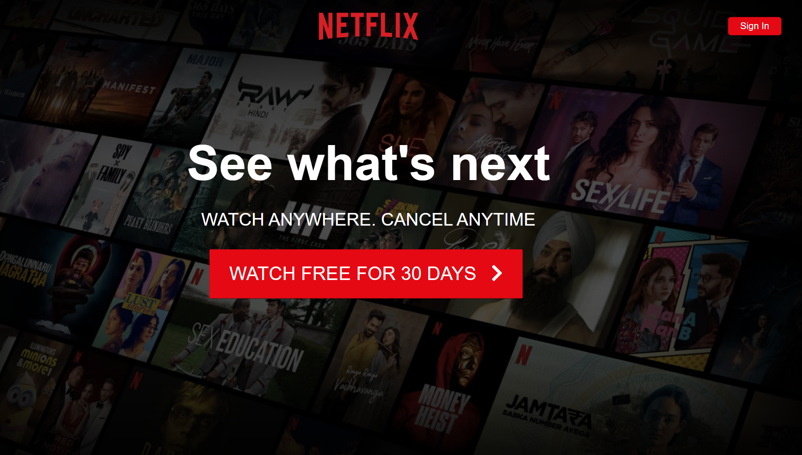
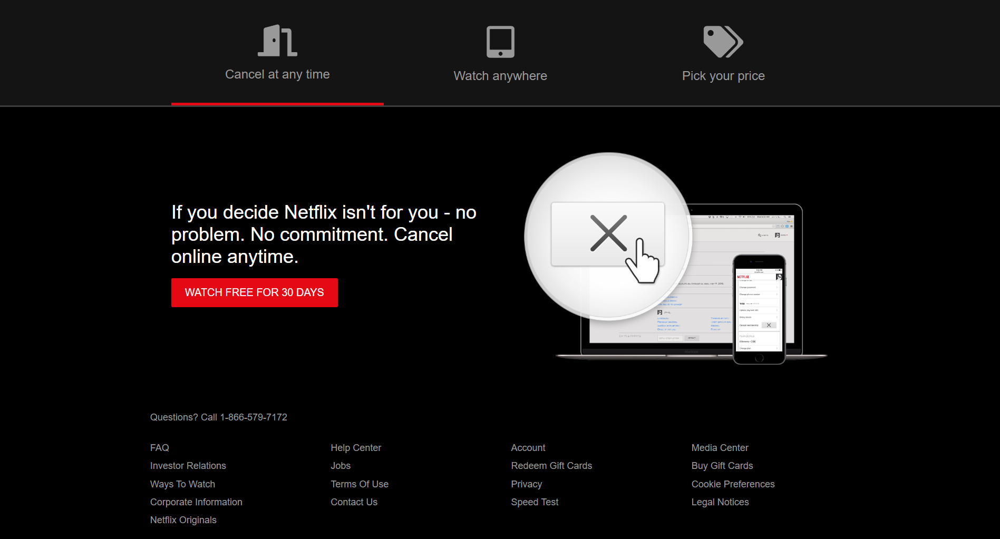

Netflix Webpage

Table of Contents

1. #overview
2. #features
3. #technologies-used
4. #installation
5. #usage
6. #contributing
7. #license

Overview

This is a Netflix webpage clone built using HTML, CSS, JavaScript, and React. The webpage features a responsive design, user authentication, and a dynamic content library.

Features

- User authentication with login and signup functionality
- Dynamic content library with movie and TV show information
- Responsive design for desktop, tablet, and mobile devices
- Search bar for easy content discovery
- Genre-based content filtering

Technologies Used

- Frontend: React, HTML, CSS, JavaScript
- Backend: Node.js, Express.js
- Database: MongoDB
- APIs: TMDB API (The Movie Database)

Installation

1. Clone the repository: `git clone (link unavailable)
2. Install dependencies: npm install
3. Start the server: npm start

Usage

1. Open the webpage in your browser: http://localhost:3000
2. Login or signup to access content
3. Browse and search for movies and TV shows

Contributing

Contributions are welcome! Please submit a pull request with your changes.

License

This project is licensed under the MIT License.

Authors

- (link unavailable)

Acknowledgments

- TMDB API for providing movie and TV show data

Note: Replace your-username with your actual GitHub username.

This README file provides essential information about the Netflix webpage project, including features, technologies used, installation instructions, usage guidelines, and contribution information.

To make your README file more engaging, consider adding:

- Screenshots or images of the webpage
- GIFs demonstrating features
- Badges for dependencies or licenses
- Links to live demos or deployed versions
